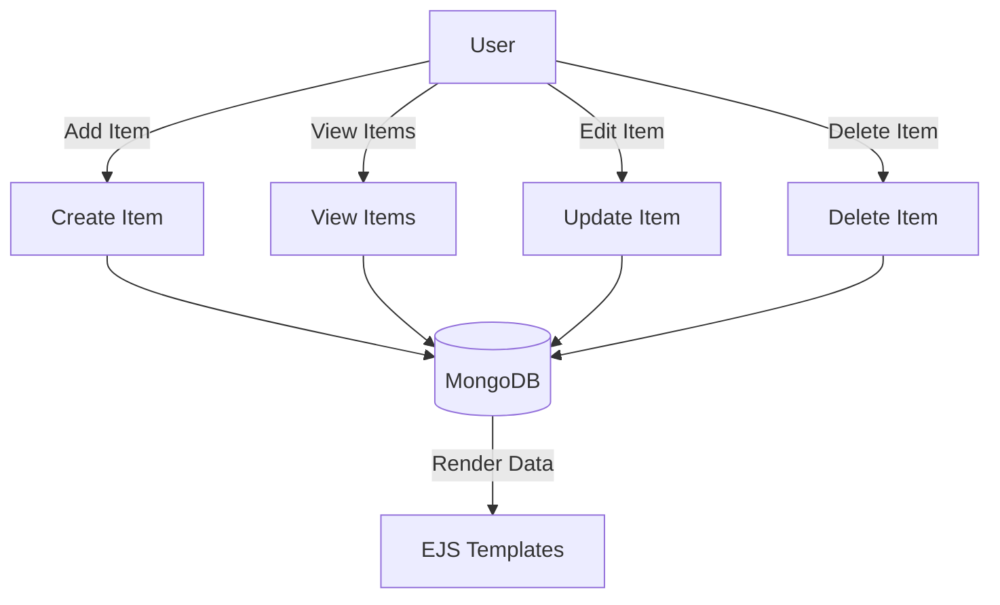

# MongoDB-CRUD
A full-stack CRUD app (Inventory Manager) using Node.js, Express, MongoDB, and EJS.


# 🛒 Inventory Manager (Node.js + Express + MongoDB + EJS)

A simple **CRUD web application** built with `Node.js`, `Express.js`, `MongoDB` (via `Mongoose`), and `EJS` templates.  
The app lets users manage an inventory of items with features to **Create, Read, Update, and Delete**.

---

## 🚀 Features
- ➕ **Create** new items (name, description, price)  
- 📖 **Read** and display all items in a list  
- ✏️ **Update** item details using an editable form  
- 🗑️ **Delete** items from the database  

---

## 🛠️ Tech Stack
- **Backend**: Node.js, Express.js  
- **Database**: MongoDB with Mongoose ODM  
- **Frontend**: EJS Templates (index.ejs, new.ejs, edit.ejs)  
- **Other Tools**: nodemon (for development), body-parser  

---

## 📂 Project Structure
├── index.js          # Main server file  
├── views/            # EJS templates  
│   ├── index.ejs     # List all items  
│   ├── new.ejs       # Form for creating items  
│   └── edit.ejs      # Form for editing items  
├── package.json      # Dependencies and scripts  
└── README.md         # Documentation  


---

## 🔄 CRUD Flow (Mermaid Diagram)



---

## ⚡ Installation & Usage

```bash
# 1. Clone the repository
git clone https://github.com/your-username/inventory-manager.git
cd inventory-manager

# 2. Install dependencies
npm install

# 3. Run the app
node index.js

# Or (with nodemon for hot reload)
npm run dev

# 4. Open in browser
http://localhost:3000
```
